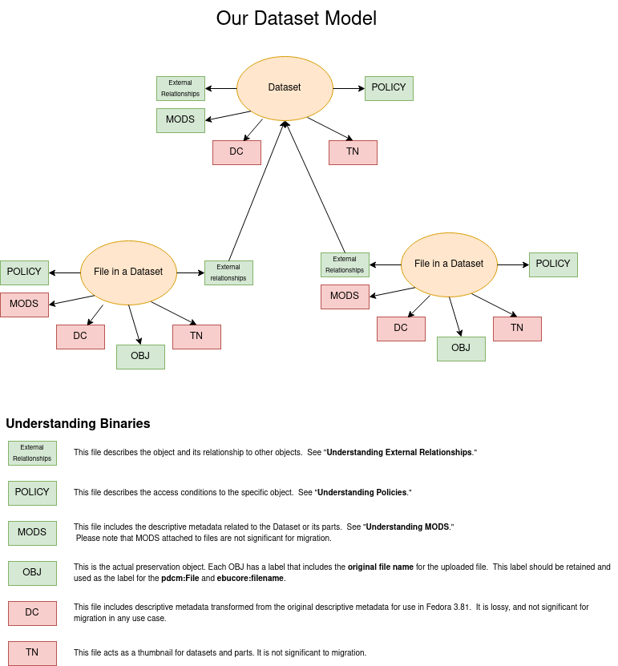

Overview
========

Our datasets are made up of multiple Fedora 3.8.1 objects. Each object has its own set of binaries and is related to
each other in structural metadata described in our RDF.

In the diagram above, Fedora objects are represented with orange circles. The arrows pointing to squares refer to binaries
associated with each object. Arrows from squares to other object represent RDF triples that describe a relationship
between the object the binary is associated with and the object the object is related to. The color represents whether
we feel the binary is relevant for migration.
